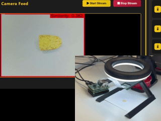

# sensAI Reference Designs Repository
This repository includes reference designs for various Edge AI applications to leverage Lattice hardware such as the CLNX and CPNX platforms.

>[!NOTE]
>This repository uses Git LFS for artifact distribution and is not intended for active collaboration. It is not recommended to download the entire repository; instead, download individual files, archives, or use the provided download links.

## Human Machine Interface Demo
The [CrossLinkU™-NX System-on-Module (SoM) HMI Demonstration Design](https://www.latticesemi.com/products/designsoftwareandip/intellectualproperty/demos/human-to-machine-interfacing-demonstration) is a demo solution for Human-Machine Interface (HMI) applications. It enables AI-driven interaction capabilities such as person detection, face recognition, and face identification, delivering intuitive and intelligent user experiences at the edge.
This design is optimized for low-power embedded vision systems, leveraging Lattice’s FPGA technology and AI pipeline for real-time inferencing. It integrates with Raspberry Pi CM5 for visualization and control through a web-based dashboard.

[Setup the CLNX HMI Demo](demo/clnx/README.md)

## GARD Architecture

The Lattice CertusPro™‑NX FPGA‑based System‑on‑Module (SOM) provides a compact and production‑ready platform that integrates compute, memory, connectivity, and hardware acceleration into a single industrial‑grade module. Designed for edge AI workloads, the SOM simplifies system integration, reduces development time, and delivers reliable operation in constrained or rugged environments.  

Lattice Golden AI Reference Design (GARD) builds on this foundation by offering a purpose‑built, well‑tested hardware platform paired with reusable AI models, firmware, and a streamlined software stack. Together, these components accelerate the design and deployment of intelligent edge applications using Lattice FPGAs and the Lattice sensAI™ solution stack.  

[GARD Application Reference Design User Guide](dev/gard/docs/FPGA-RD-02332-1-0-sensAI-GARD-Application-Reference-Design-User-Guide.pdf)  
[GARD source code and packages](dev/gard)

## Multiple Object Detection GARD Based Application

Multi-object detection (MOD) plays a crucial role in enabling machines to perceive and interpret complex visual environments. From autonomous vehicles and surveillance systems to smart retail and robotics, the ability to accurately detect and classify multiple objects in real-time is foundational to many modern AI applications.  

This reference design application runs MOD on a system-on-module hosting a Lattice CertusPro™-NX device. The aim is to showcase the capabilities of the solution in identifying and localizing various objects within images or video streams.  

A key focus of this implementation is the deployment of MOD on small form factor devices, such as edge AI modules, embedded systems, and mobile platforms. These compact yet powerful devices enable real-time inference at the edge, reduce latency, preserve privacy, and minimize the need for cloud-based processing.

_Automotive classes Object Detection reference design demo applicaiton runing on Lattice CertusPro™-NX SOM_

[Setup the CPNX MOD Demo](demo/cpnx/mod/README.md)

## Defect Detection GARD Based Application

Defect detection (DD) plays a crucial role in enabling machines to distinguish between normal objects and those with visual defects. In production facilities and assembly lines, the ability to accurately detect defects in real time is fundamental to most manufacturing processes.

This reference design application runs DD on a system-on-module (SOM) hosting a Lattice CertusPro™-NX device. This implementation is meant as a proof of concept to showcase the ability to run a defect detection model that was trained using few-shot learning on an edge AI module. As the camera part of the design is a general purpose camera, the reference design cannot be used as-is, but its architecture, defect detection backbone model, and few-shot learning toolchain provide a great starting point for a far edge AI production solution.

_Defect Detection reference design POC runing on Lattice CertusPro™-NX SOM_

[Setup the CPNX DD POC](demo/cpnx/dd/README.md)

