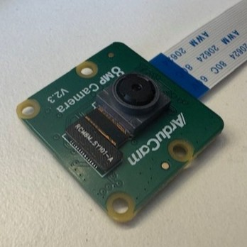
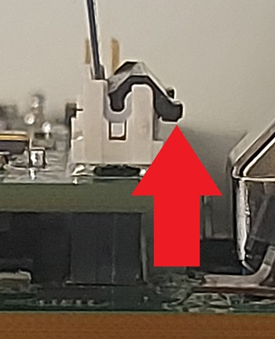
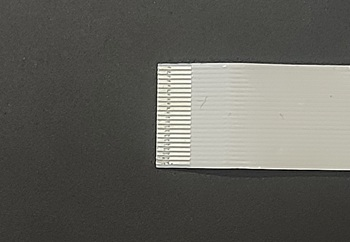
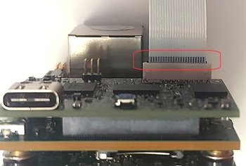
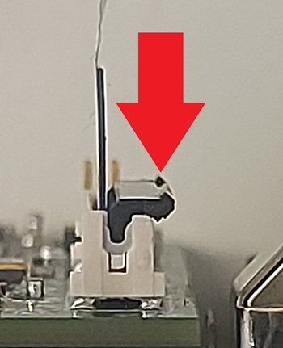

# Instructions to Convert the CrossLinkU-NX SoM for HMI Setup to Wide FOV or Hand Gesture Setups
> [!CAUTION]
> This document provides instructions for converting the CrossLinkU-NX SoM HMI demo setup to a configuration that supports a wide FOV camera or gesture detection. These features are provided as a preview of functionality that will be available in a future update of the HMI demo package. Because this is a preview, you may encounter issues or unexpected behavior. It is recommended to revert to the standard configuration after testing to maintain system stability.

## Introduction
This document provides instructions for converting the CrossLinkU-NX SoM for HMI to one of the following:
- HMI with wide FOV camera
- Hand Gesture with normal camera

It also includes instructions to revert to the standard HMI with regular camera setup.

## Requirements

Ensure the following items are available before starting:
- **CrossLinkU-NX SoM for HMI Demonstration** document, issued by **Lattice Semiconductor**
- One CrossLinkU-NX SoM board and Raspberry Pi setup as described in the **CrossLinkU-NX SoM for HMI Demonstration** document
- One Windows PC with **Radiant Programmer** and **PuTTY** installed
- One micro-USB to USB-A cable
- One ethernet cable
- Network to USB converter if your computer does not have a RJ45 jack

## Cameras

### Regular FOV Camera



The regular HMI demo and gesture demo setups use the regular FOV camera.

### Wide FOV Camera


The wide FOV demo requires the Wide FOV camera:

### Changing the Camera (Only to switch to/from Wide FOV camera configuration)
Identify the camera cable connector on the board.

Release the cable by lifting the socket lever upward, as shown in the image below. Then remove the cable:



Identify the contact surface on the camera that will be installed, as shown in the image below:



Insert the camera cable so that the contact surface faces the side shown in the image below:



Secure the cable by pressing the socket lever downward, as shown in the image below:



## Package Structure
The package includes two sets of software, and each set contains files for different configurations, as listed below:

### FPGA Binary Files
- Hand Gesture → `conversion_package/firmware/hand_gesture`
- HMI Normal → `conversion_package/firmware/HMI_normal_camera`
- HMI Wide → `conversion_package/firmware/HMI_wide_fov_camera`

### Web Server Files
- Hand Gesture → `conversion_package/web_server/hand_gesture`
- HMI → `conversion_package/web_server/hmi`

The table below provides the files needed for each configuration.

| Setup Configuration | FPGA Binary File | Web Server File | Camea |
|----------------------|-------------|------------| --- |
| Wide FOV Camera | HMI Wide | HMI | Wide FOV camera |
| Hand Gesture (with regular camera) | Hand Gesture | Hand Gesture | Regular Camera |
| Revert to standard HMI configuration (with regular camera)  | HMI Normal | HMI | Regular Camera |

# Setup Process
In order to convert the system to the WFOV, gesture support, or back to standard HMI setup, follow the steps below while referring to the table above to determine which component is needed.

## 1 Flashing the FPGA

After identifying the files required for the selected configuration from the table above, proceed with the following steps:

1. Refer to **Programming the Bit File** chapter of the **CrossLinkU-NX SoM for HMI Demonstration** document to load the FPGA bit file.
1. Refer to **Connecting the RPi CM5 Ethernet** chapter of the same document to maintain the Ethernet connection.

## 2 Transferring the Web Server to the Raspberry Pi

1. Unzip the Web Server file on the <ins>PC</ins>.
2. Find the Raspberry Pi’s IP address by running the following command on PuTTY:
 ````bash
 ifconfig
 ````
3. Run this command on PuTTY to access the configuration menu:
````bash
sudo raspi-config
````
4. Select **Interface Options** and press **Enter**.
5. Select **Enable/disable remote command line access using SSH** and press **Enter**.
6. Select **YES** and press **Enter**.
7. Exit the menus
8. Run the following command on PuTTY to ensure that no folders remain from previous configuration processes:
````bash
sudo rm -r /home/lattice/edgeHub
````
9. Verify PSCP on the <ins>PC</ins>:
````powershell
pscp --version
````
10. Install PSCP if not installed.
11. Copy the Web Server to Raspberry Pi:
````powershell
pscp -r -pw "lattice" <path-to-unzipped-web-server-folder> lattice@<Raspberry Pi IP address>:/home/lattice/
````

Example:

````powershell
pscp -r -pw "lattice" C:\Users\the_user\Downloads\conversion_package\web_server\hmi\edgeHub\edgeHub lattice@192.168.137.120:/home/lattice/
````
12. Answer **no** to **Store key in cache? (y/n, Return cancels connection, i for more info)**.
   
## 6 Installation on RPi

Replace the existing Web Server folder with the one provided in the package by running the following commands on PuTTY:

````bash
sudo rm -rf /opt/edgeHub/
sudo mkdir -p /opt/edgeHub/
sudo cp -r /home/lattice/edgeHub/* /opt/edgeHub/
````

## 7 Testing

1. Refer to **Running EVE and Web Server** chapter of the **CrossLinkU-NX SoM for HMI Demonstration** document to run the Web Server.
2. If successful, delete the transferred folder by running the following command on PuTTY:
````bash
sudo rm -r /home/lattice/edgeHub
````

