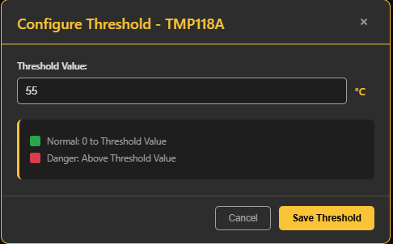
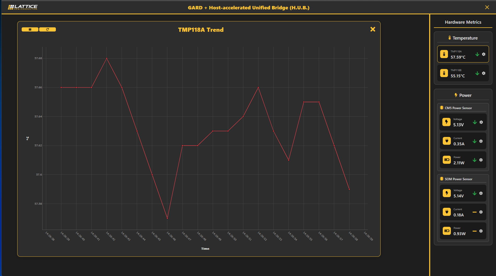

# Python App - EdgeHUB

A web application for real-time graphical visualization of temperature and energy sensors' data.

## Prerequisites

1.  Python 3.10 or above is installed.
2.  Install libhub Debian package.
    1.  Go to GITHUB [releases of HUB](https://github.com/LSCC-Architecture/HUB/releases)
    2.  Download the debian package from 'Assets' - it would be named: lscc-hub_<hub_version>_arm64.deb
        For example for version 1.3.0, the file name is lscc-hub_1.3.0_arm64.deb
    3.  Run `sudo apt install <path_to_package>/lscc-hub_<version>_arm64.deb -y` to install the package.
3.  Create a python virtual environment using following commands:
    1.  Go to directory where you want to create a virtual environment. Preferably HUB/.
    2.  Run `python -m venv <env_name>` to create.
    3.  Run `source <env_name>/bin/activate` to use created environment.
4.  Install python wheel package in the activated virtual environment.
    1.  Go to GITHUB [releases of HUB](https://github.com/LSCC-Architecture/HUB/releases)
    2.  Download the wheel package from 'Assets' - it would be name lscc_hub-<hub_version>-py3-none-manylinux_2_28_arm64.whl
        For example for version 1.3.0, the file name is lscc_hub-1.3.0-py3-none-manylinux_2_28_arm64.whl
    3.  Run `pip install <path_to_package>/lscc_hub-<hub_version>-py3-none-manylinux_2_28_arm64.whl` to install package.
5.  Install python package requirements of edgeHUB.
    1.  Go to `HUB/src/hub/hub_apps/edgeHUB`
    2.  Install requirements using `pip install -r requirements.txt`
6.  Setup SSL certificates for secure HTTPS access to the EdgeHUB application.
    1.  Equip with SSL key and certificate. If not available, refer to Guide 1 "SSL Certificate Generation" to generate the SSL key and certificate.
    2.  Install the certificate by referring to Guide 2 "Browser Certificate Installation".
    3.  Restart the browser for seamless access.
    4.  Update configuration in config.json file. 
    5.  Make sure paths are updated for "server.crt" and "server.key" files. If given guides are used for SSL key-cert generation, ensure you have newly created files at the default path `edgeHUB/`.
7.  Run `deactivate` to come out of environment after usage.

## Guides

### Guide 1 >> SSL Certificate Creation

Web application uses HTTPS. This guide will help you set up SSL certificates for secure HTTPS access to the EdgeHUB application.

If you want to generate a custom certificate for your specific environment, follow the following steps.

1.  Run the certificate generation script using ```python scripts/key_cert_generation.py```
    Note : Ensure you are on the same network to access the application on which you have generated the certificates.
2.  The script will generate following files:
    -   `server.crt` - Self-signed certificate (public)
    -   `server.key` - Private key (keep secure)
3.  Move the generated `server.crt` file to the machine where you will be accessing the browser.

### Guide 2 >> Browser Certificate Installation

1.  Open browser and navigate to User Certificates section of Certificate Manager. ```<browser>://certificate-manager/localcerts/usercerts```
    Microsoft Edge - ```edge://certificate-manager/localcerts/usercerts```
    

    Google Chrome - ```chrome://certificate-manager/localcerts/usercerts```
    

2.  Go to 'Trusted Certificates' section.
3.  Click on 'Import'.
4.  Browse and select `server.crt` (self-signed certificate) from your project directory.

This will allow browser to bypass SSL warnings and access HTTPS without issues.

### Guide 3 >> Change Configuration

1.  Go to ```HUB/src/hub/hub_apps/edgeHUB/config.json```
2.  To change port, edit `server.port` field to desired port.
3.  If you have cert and key files, provide the paths to `ssl.cert_file` and `ssl.key_file` variables.
4.  You can also change app's running mode to debug by setting `server.debug` to true.

### Important Notes

-   **Bypass Warnings**: This will allow browser to bypass SSL warnings and access HTTPS without issues.
-   **Multiple Chrome Browsers**: If you use different Chrome accounts/profiles, you need to import the certificate individually for each one.
-   **Other Browsers**: Similar steps apply to other Chromium-based browsers.
-   Application currently uses SSL port 443, so browser(localhost) will automaticaly detect port instead of specifying it in url, so it may appear like https://127.0.0.1 instead of https://127.0.0.1:443.
-   **Security Note**: These are self-signed certificates intended for development and testing purposes. For production environments, consider using certificates from a trusted Certificate Authority.


### Run

1.  Change directory to `HUB/src/hub/hub_apps/edgeHUB`.
2.  To suppress SSL warnings refer to Guides 1 & 2.
2.  Run `python app.py` to get application up and running.
3.  It will run the web application on 443 port. To change port refer to Guide 3.
4.  Open the link mentioned in the terminal (say, Running on ...") in a web browser to see the web app in action.
5.  Use on-page buttons to navigate through features. Find details at "Features" section.


### Features

**Landing Page**


**Hardware Metrics Console**


-   On the right side, you can see a panel displaying live data from various sensors.
-   The header shows which performance metrics is being displayed.
-   The arrow shows has the value decreased, increased or remained constance compared to the last reading.
-   The GREEN color indicates the value is below the threshold value, whereas the RED color indicates the value is greater than the threshold value.
-   This threshold value can be configured using a section in 'Gear' icon.



**Sensor Trends**

Click on the sensor box to view graphical representation of temperature data.


